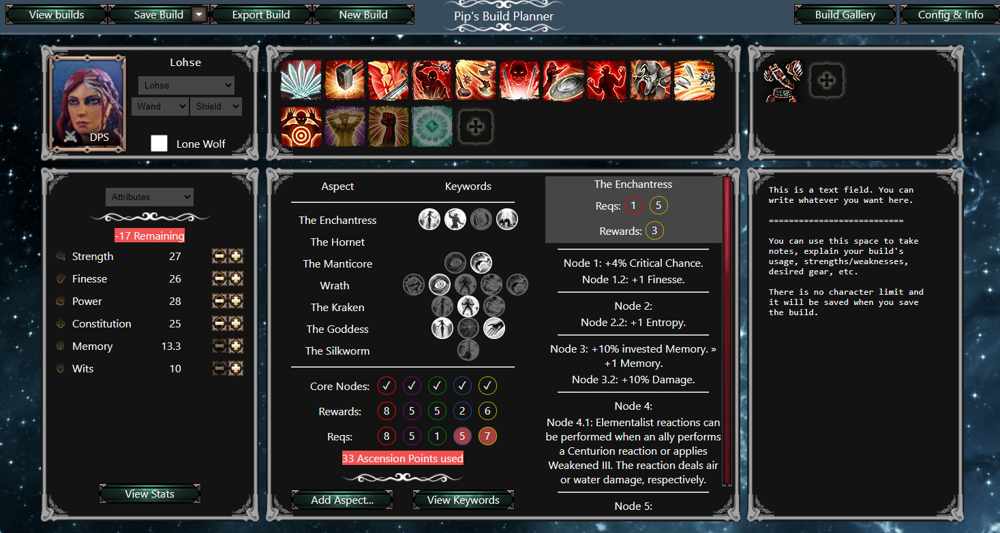

Build planner app for [Epic Encounters 2](https://docs.google.com/document/d/1du5jE2dyDE4B4-Za0wolfe50ReeKXqkqdgG5FvAwKTo/edit#) made in React.

Hosted at <https://www.pinewood.team/ee2buildplanner/>

Features:
- Skill viewer, featuring correctly formatted tooltips with accurate in-game stats
- Ascension functionality:
    - Add aspects and choose subnodes
    - View node effects, embodiment requirements and rewards
    - View all of your build's keyword activators and mutators at quick glance - including keyword boons from Artifacts
- Attribute/ability/civils/talents trackers
- Artifacts and runes
- Tally counters for stat boosts from Ascension, attributes, etc.
- Sharing functionality through .json and a community build gallery with links

The Scripts folder in /public/ contains the python scripts that were used to parse game data. You're free to use these for your own projects, though they're a bit of a mess at the moment.